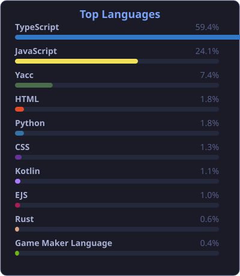

<h1>Hi there, I'm Wesley Also known as Ehz 👋</h1>
<h3>A passionate developer from the Netherlands</h3>

  

---

###  About Me

 I’m currently working on <b>Treffortly and Aylian Studios</b> 
 I’m currently learning <b>Rust and distributed systems/Robotics</b> 
 Ask me about <b>APIs, testing, CI/CD, AI</b>

---

### 🛠️ Languages and Tools

---

### 📊 Most Used Languages

 

---

### 📫 Connect with Me

