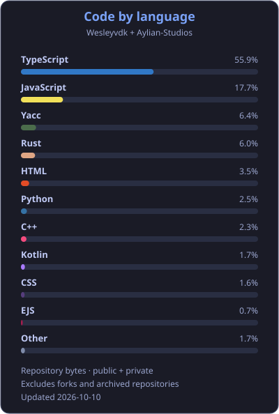

# Wesley · Ehz

**Developer from the Netherlands**  
Web products · APIs · Local AI · Linux

[Website](https://aylian-studios.com) · [Email](mailto:ehz@treffortly.com) · [Discord](https://discord.gg/G85n7RCpBw)

---

## About me

I build web applications, APIs, and tools for gaming communities. I also run AI locally and contribute improvements back to the software I use.

## What I'm focused on

- **Aylian Studios & Treffortly** — building web products and the services behind them. [Visit Aylian Studios](https://aylian-studios.com).
- **APIs & automation** — connecting applications, building Discord integrations, and working with testing and CI/CD.
- **Local AI & Linux** — running Qwen models through Strata on an AMD RX 9070 XT, with ROCm and Omarchy.
- **Open source** — contributing HIP image input and AMD GPU monitoring improvements to Strata.

I'm also exploring **Rust, distributed systems, and robotics**.

## Project highlights

| Project | Focus |
| --- | --- |
| [Maquette](https://aylian-studios.com/projects/maquette) | A workspace for image-to-3D creations, with a browser viewer for models and environments. |
| [Lumen](https://aylian-studios.com/projects/lumen) | An AI workspace for turning conversations into apps and experiences you can keep developing. |
| [Carapace](https://aylian-studios.com/projects/carapace) | AI agents that navigate and act through ComputerCraft turtles, using planning and reusable skills. |
| [Treffortly](https://aylian-studios.com/projects/treffortly) | A productivity platform bringing tasks, writing, job applications, and finances together through a GraphQL API. |
| [Ballchasing Uploader](https://aylian-studios.com/projects/ballchasing-uploader) | A Rust desktop tool that automatically uploads Rocket League replays to ballchasing.com. |
| [Strata contribution](https://github.com/Niko1221/Strata/pull/381) | HIP image input, native IQ PLE packing fixes, and Linux AMD GPU telemetry, validated on an RX 9070 XT. |

[Explore all Aylian Studios projects →](https://aylian-studios.com/projects)

## Languages & tools

  
  
  
  
  
  
  
  

Language activity across my repositories

 

## Get in touch

Happy to talk about APIs, web products, gaming communities, Linux, or running AI locally.

**[ehz@treffortly.com](mailto:ehz@treffortly.com)** · [Aylian Studios](https://aylian-studios.com) · [Discord community](https://discord.gg/G85n7RCpBw)
